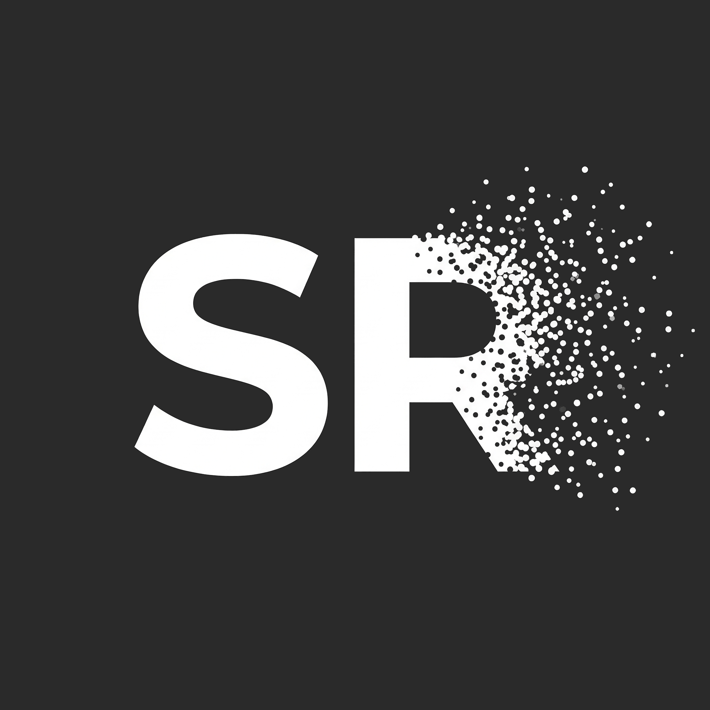
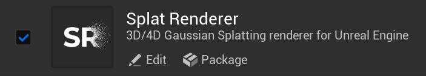
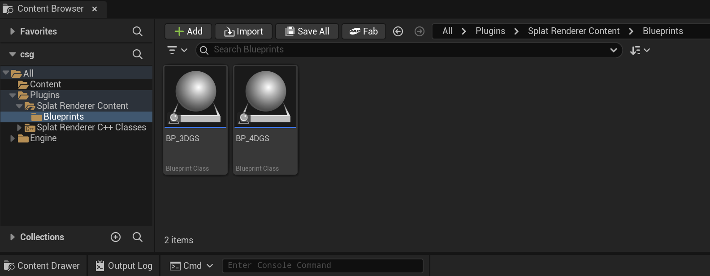
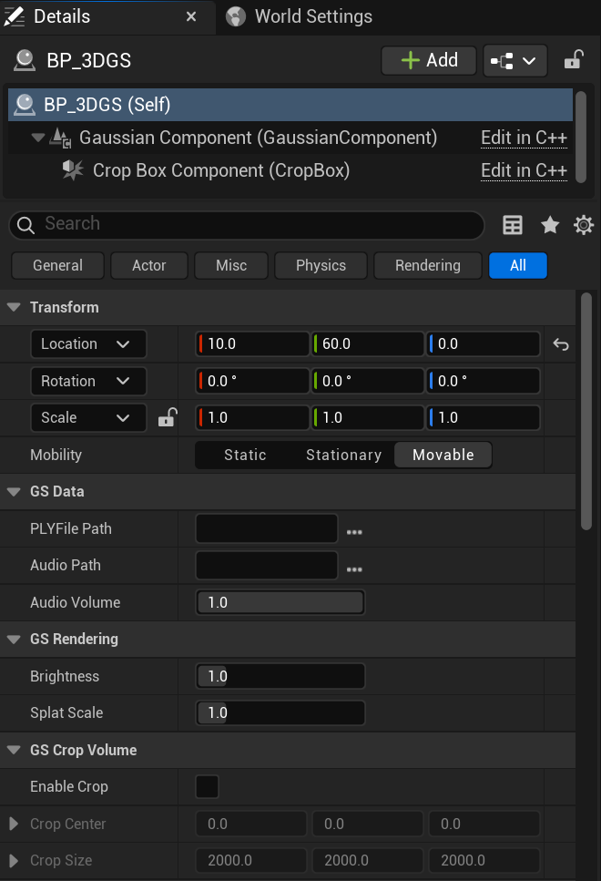
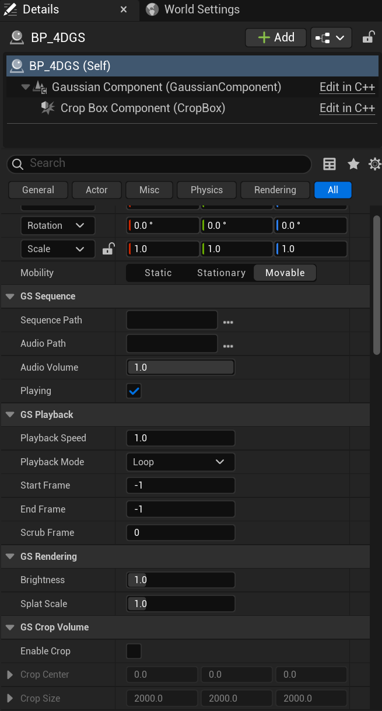

# Splat Renderer

3D/4D Gaussian Splatting renderer plugin for Unreal Engine 5.6.

---

## Table of Contents

- [Features](#features)
- [Getting Started](#getting-started)
- [Usage](#usage)
- [4DGS Sequence](#4dgs-sequence)
- [Requirements](#requirements)
- [License](#license)

---

## Features

- **3DGS** — Real-time rendering of static Gaussian Splats from `.ply` files
- **4DGS** — Playback of 4D Gaussian Splat sequences (`.gsd` format)
- **Crop Volume** — OBB crop box with draggable editor widget
- **Rendering Controls** — Brightness, splat scale
- **Audio** — WAV playback synced to sequence

---

## Getting Started

### 1. Download

Download the latest release from the [**Releases**](https://github.com/DazaiStudio/SplatRenderer-UEPlugin/releases) page.

Extract `SplatRenderer` into your project's `Plugins/` directory.

### 2. Open Your Project

Launch your project in Unreal Engine 5.6. The plugin will be loaded automatically.

Verify in **Edit > Plugins** by searching for **Splat Renderer**.

### 3. Add to Level

Open the **Content Browser** and navigate to **Plugins > Splat Renderer Content > Blueprints**.

Drag **BP_3DGS** or **BP_4DGS** into your level and configure in the **Details** panel.

---

## Usage

### BP_3DGS — Static Gaussian Splats

Set `PLY File Path` to any standard 3DGS `.ply` file (COLMAP, Luma, PostShot, etc.)

### BP_4DGS — 4D Gaussian Splat Sequences

Set `Sequence Path` to a `.gsd` file.

| Property | Description |
|----------|-------------|
| Sequence Path | Path to `.gsd` sequence file |
| Audio Path | Optional WAV file for synced audio |
| Playback Speed | 1.0 = normal speed |
| Playback Mode | Loop or Once |
| Start/End Frame | -1 = auto (use all frames) |
| Scrub Frame | Manually seek to a specific frame |
| Brightness | Adjust splat brightness (0.0 - 5.0) |
| Splat Scale | Adjust splat size (0.01 - 5.0) |
| Crop Volume | Enable OBB crop box to mask regions |

---

## 4DGS Sequence

Use [**4DGS Converter**](https://github.com/DazaiStudio/4dgs-converter) to convert 4DGS training output into `.gsd` files with LZ4 compression and random frame access.

---

## Requirements

- Unreal Engine 5.6
- Windows (DirectX 12)

---

## Author

**Dazai Chen** — Creative Technologist & Lighting Designer

[Website](https://dazaistudio.com) | [GitHub](https://github.com/DazaiStudio) | [LinkedIn](https://www.linkedin.com/in/dazai-chen-280186183/)

---

## Support

---

## License

All rights reserved. For evaluation and testing purposes only.
